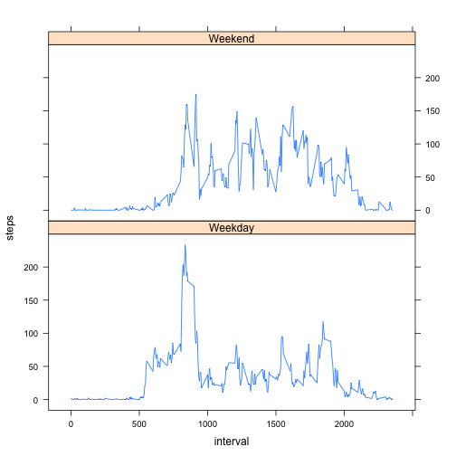

# Reproducible Research: Peer Assessment 1


## Loading and preprocessing the data


```r
#Load Library
library("timeDate")
library("lattice")

#Load CSV file 
dataTotal<-read.csv("activity.csv",  header=T)

#Clean data from NA
data<-na.omit(dataTotal)

#New Dataframe aggregated by day 
dataByDay<-aggregate( steps ~ date * date, FUN=sum, data=data)
```

## What is mean total number of steps taken per day?
### The total number of steps taken each day in the form of an histogram show that there is a higher concentration of steps between 10,000 & 15,000 per day

```r
#Create a histogram of the total number of steps taken each day
print(hist(dataByDay$steps))
```

 

```
## $breaks
## [1]     0  5000 10000 15000 20000 25000
## 
## $counts
## [1]  5 12 28  6  2
## 
## $density
## [1] 1.887e-05 4.528e-05 1.057e-04 2.264e-05 7.547e-06
## 
## $mids
## [1]  2500  7500 12500 17500 22500
## 
## $xname
## [1] "dataByDay$steps"
## 
## $equidist
## [1] TRUE
## 
## attr(,"class")
## [1] "histogram"
```

### Mean of steps taken per day

```r
#Calculate the mean of total number of steps taken per day, create a new dataset of the data by mean
meanS<-mean(dataByDay$steps)
dataBymean<-aggregate( steps ~ date * date, FUN=mean, data=data)
print(meanS)
```

```
## [1] 10766
```

### Median of steps taken per day

```r
#Calculate the median of total number of steps taken per day, create a new dataset of the data by median
medianS<-median(dataByDay$steps)
dataBymedian<-aggregate( steps ~ date * date, FUN=median, data=data)
print(medianS)
```

```
## [1] 10765
```

## What is the average daily activity pattern?

```r
#Make a time series plot (i.e. type = "l") of the 5-minute interval (x-axis) and the average number of steps taken, averaged across all days (y-axis)
dataByInterval<-aggregate( steps ~ interval, FUN=mean, data=data)
plot(dataByInterval,type="l")
```

 

### The 5 minute interval on average across all the days in the dataset, contains the maximum number of steps is 835 with 206.1698 steps

```r
#Which 5-minute interval, on average across all the days in the dataset, contains the maximum number of steps?
print(maxIntData<-dataByInterval[dataByInterval$steps==(max(dataByInterval$steps)), ])
```

```
##     interval steps
## 104      835 206.2
```


## Imputing missing values
### There are a total of 2304 NA values that need to be replaced.

```r
#Total NA values
print(totalNA<-sum(is.na(dataTotal)))
```

```
## [1] 2304
```
### The strategy to replace those values, is to take the average value for that particular interval across days
### If a value is detected as NA, the average number is retreived and replaced for the NA value, if it is not NA it is left with the original value


```r
#Fill in missing values
dataTotal$stepsNAR<-ifelse(is.na(dataTotal$steps), 
                     #TRUE
                    dataByInterval$steps[dataByInterval$interval==dataTotal$interval],
                     #FALSE
                    dataTotal$steps
)

#NewDataSet with Missing Values replaced

newData<-subset(dataTotal,select = c("date", "interval","stepsNAR"))
names(newData)<-c("date","interval","steps")
```


## Are there differences in activity patterns between weekdays and weekends?
### The total number of steps taken each day remain the same as it can be seen in the form of an histogram 


```r
#Create a histogram of the total number of steps taken each day
#New Dataframe aggregated by day 
dataByDayNAR<-aggregate( steps ~ date * date, FUN=sum, data=newData)

#Create a histogram of the total number of steps taken each day
print(hist(dataByDayNAR$steps))
```

 

```
## $breaks
## [1]     0  5000 10000 15000 20000 25000
## 
## $counts
## [1]  5 12 29  6  2
## 
## $density
## [1] 1.852e-05 4.444e-05 1.074e-04 2.222e-05 7.407e-06
## 
## $mids
## [1]  2500  7500 12500 17500 22500
## 
## $xname
## [1] "dataByDayNAR$steps"
## 
## $equidist
## [1] TRUE
## 
## attr(,"class")
## [1] "histogram"
```

### Mean of steps taken per day remains the same

```r
#Calculate the mean of total number of steps taken per day, create a new dataset of the data by mean
#Calculate and report the mean and median total number of steps taken per day
meanSNAR<-mean(dataByDayNAR$steps)
dataBymeanNAR<-aggregate( steps ~ date * date, FUN=mean, data=newData)
print(meanSNAR)
```

```
## [1] 10766
```

### Median of steps taken per day remains the same

```r
#Calculate the median of total number of steps taken per day, create a new dataset of the data by median
medianSNAR<-median(dataByDayNAR$steps)
dataBymedianNAR<-aggregate( steps ~ date * date, FUN=median, data=newData)
print(medianSNAR)
```

```
## [1] 10766
```

### Weekdays and weekends present a slight difference. While Weekdays have higher number of steps taken into a single interval, weekends remain more active. 

```r
#get a new data frame with days marked as weekday or weekend
newData$week<-ifelse(isWeekday(newData$date), 
                           #TRUE
                           "Weekday",
                           #FALSE
                           "Weekend"
)

#Aggregate data by weekday
weekData<-aggregate( steps ~ interval*week, FUN=mean, data=newData)

#Plot

print(xyplot(steps ~ interval | factor(week), data=weekData,type="l", layout=c(1,2)))
```

 


